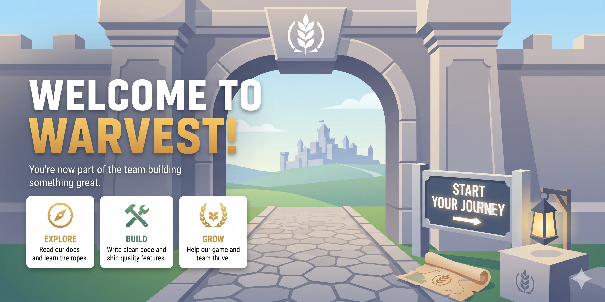

Welcome to the Warvest engineering team. This document is your entry point to getting set up and understanding our project.

## 1. Quick Setup
1. **Clone the Repo**: Ensure you have Git LFS installed before cloning.
2. **Unity Version**: Ensure you use the exact Unity version specified in the project settings (currently `6000.4.7f1`). Use Unity Hub to install it.
3. **Open the Project**: Open the `warvest-unity` folder in Unity. The first open may take some time as it imports assets and builds the Library.

## 2. Reading List
Please read the following living documents to get a handle on how we build things here:

- **[Architecture Overview](../4] 🏗️ architecture/README.md)**: How the project is structured.

- **[Standards](../2] 📏 standards/README.md)**: How we branch, write, and name things.

## 3. Engineering Philosophy
- **One Source of Truth**: All engineering docs live right here in the `/docs` folder. Not in ClickUp, not in an external wiki. 
- **Decisions are Documented**: Major decisions become Architecture Decision Records (ADRs). Current system behavior belongs in Architecture docs.

Let's build something great!